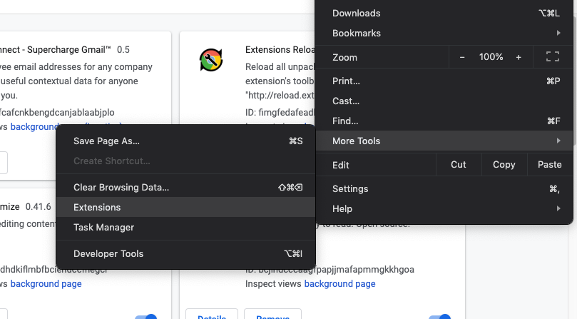
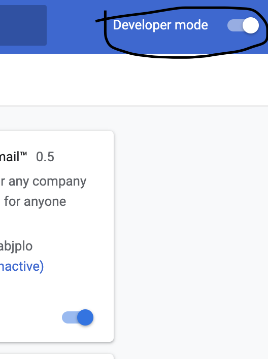
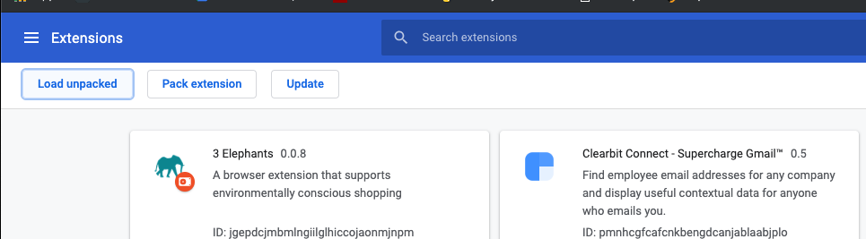
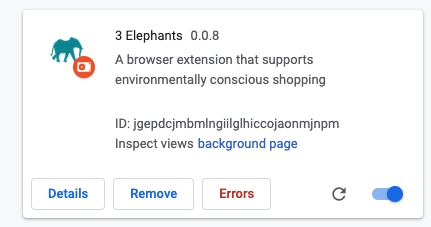

# 3 Elephants

3 Elephants is a chrome extension that encourages eco-friendly consumer behaviors while online.
Right now we do this by reviewing the eco-friendliness of products on Amazon.
If you are curious to learn about the project roadmap; please check out our [Trello Board](https://trello.com/b/ar3tb4be/3elephants).

[](https://travis-ci.org/3elephants/3elephants)

## Getting Started

### Prerequisites

* node (v8 or greater - [update node by reinstalling it](https://nodejs.org/en/) if you don't have this)
* npm
* python3.5 or greater
* MongoDB 4.0 or greater (optional if you do not plan to modify the database)


### Initial Setup
```
git clone https://github.com/3elephants/3elephants
git checkout -b <your_name>_branch
cd frontend_sandbox
npm i
npm install -g parcel-bundler
```
### Running the Frontend
```
cd frontend
```
#### For a Development Build
```
./frontend_sandbox/install/dev_deploy.sh
```
What this script does is that it compiles and bundles the `frontend_sandbox` code into `dist/`. Additionally, it watches the code for any additional changes automatically updating `dist/` when changes in `frontend_sandbox` occur.

#### For a Production Build
```
./frontend_sandbox/install/prod_deploy.sh
```

Open the Chrome Extensions Page.


Turn on Developer Mode on the top right corner.




Click "Load Unpacked" on the top left corner.



Navigate to the [frontend/frontend_sandbox/dist](frontend/frontend_sandbox/dist) folder, click Select in the bottom right corner.
<!---->

The following should now appear in the chrome extensions page.


There may be a button that says that "Errors" exist if you run the development version.
This is because parcel, the frontend code bundler used by the project, in the development version, will try to update the chrome extension automatically, but it will fail to do so. You can feel free to ignore this issue.

Chrome does not automatically update the plugin when the code changes. In order to update the plugin on chrome after you've changed the code, you may either go through the steps above again or download [Extensions Reloader](https://chrome.google.com/webstore/detail/extensions-reloader/fimgfedafeadlieiabdeeaodndnlbhid), a chrome extension that reloads code for extensions with a click on a button. Suggestions and pull requests for improving the reloading experience for developers are welcome.

### Running the Backend

#### First Run
To get started with the backend:

```
# create a python virtual environment or work with your global environment if you are ok with that. But make sure your default python  
# version is 3.5 or above.
cd backend
./setup.sh
./dev_deploy.sh
```
#### Steps for Contributing to the Backend

We use AWS lambda and API gateway, so think of the backend as a group of isolated functions using API Gateway as an interface. To start contributing to the backend:

1. Add new functions to [backend/src/functions.py](backend/src/functions.py)
2. Add any necessary test cases in [backend/src/tests.py](backend/src/tests.py)  
3. Test by running the test cases or directly running the function by using `python -c 'print(<function_name>(...params))'`
4. Add a route to [backend/src/flask_server.py](backend/src/flask_server.py). This file is used for a Flask app that allows developers like yourself to contribute to the backend without having to configure their own API Gateway and AWS Lambda setup.
5. When you're done (first stop the current dev server if you are running one) and run `./dev_deploy.sh` or if you don't want to run the test cases and just want the development server `python backend/src/flask_server.py`.

Try to abstract as much work as possible into the [backend/src/lib](backend/src/lib) folder (_For now use your best judgement, based on the style of other functions, but stay posted for more specifics on how to do this._).


###  Modifying the Database

#### Data Collection
For most cases, we recommend using our preset MongoDB database URL. However, you might want to work on data collection and updating the database.

For data collection,
1. Write code used to download information in (`data_downloading/downloaders/<data_collection_project_name>`). Please comment your code and include any documentation you think may be necessary for a developer to understand it. Make a pull request to the master branch with this code.
2. Afterwards, fill out this [request form](https://forms.gle/ZYwACUHAvQHFa9fJA). As this project falls under the GPL License, the information collected through this project will not be used for commercial aims.
#### Running the Database Locally

However, if you do also want to figure out how to update the information in the database, then you must setup a MongoDB instance locally. Please note, the following instructions cater to experienced MongoDB users only.

The following steps are required:
* start mongo using `mongod`
*  Download the data from this [Google Drive Folder](https://drive.google.com/open?id=1bz84TSUN5LkenOcrm4fSfElhfvFPW4sd) (make sure it is not anywhere in the project directory)
* unzip this data
* run `mongorestore --db 3elephants dump/`
* and run
  ```
  cd <project root directory>
  cd data_downloading/downloaders
  npm i
  node data_downloading/downloaders/create_indices.js
  ```

## Running the tests

[](https://travis-ci.org/3elephants/3elephants)

#### Backend Test Cases

To run backend test cases, it is as simple as:

`py.test backend/src/tests.py`

#### Frontend Test Cases

_Coming Soon - Stay Tuned!_

<!-- ## Contributing

Please read [CONTRIBUTING.md](https://gist.github.com/PurpleBooth/b24679402957c63ec426) for details on our code of conduct, and the process for submitting pull requests to us. -->

## License

This project is licensed under the GPLv3 License - see the [LICENSE.md](LICENSE.md) file for details.

## Acknowledgments

Hat tip to contributors: Sail Allu and Aditya Aggarwal. Please add your name to this README in your pull request; we aim to acknowledge any contributions. It is contributors like yourself that make this project run - ❤️  **[3 Elephants](http://3elephants.github.io)**
